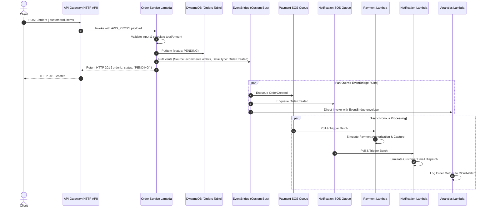

# Event Flow & Contract Specifications

This document outlines the end-to-end data contracts and message transformations as an order flows through the serverless e-commerce system.

---

## 1. End-to-End Sequence Diagram



---

## 2. Message Contract & Data Payloads

### Step 1: Client Ingress Request (`POST /orders`)

**Endpoint**: `https://<api-id>.execute-api.<region>.amazonaws.com/orders`  
**Method**: `POST`  
**Headers**: `Content-Type: application/json`

```json
{
  "customerId": "customer-123",
  "currency": "LKR",
  "items": [
    {
      "productId": "product-001",
      "quantity": 2,
      "price": 1500
    },
    {
      "productId": "product-002",
      "quantity": 1,
      "price": 2000
    }
  ]
}
```

---

### Step 2: Synchronous Response to Client

**Status**: `201 Created`  
**Latency**: `< 120ms`

```json
{
  "message": "Order created successfully",
  "orderId": "order-f47ac10b-58cc-4372-a567-0e02b2c3d479",
  "status": "PENDING"
}
```

---

### Step 3: DynamoDB Stored Item

**Table**: `event-driven-ecommerce-orders-dev`  
**Partition Key**: `orderId` (String)

```json
{
  "orderId": "order-f47ac10b-58cc-4372-a567-0e02b2c3d479",
  "customerId": "customer-123",
  "status": "PENDING",
  "totalAmount": 5000,
  "currency": "LKR",
  "items": [
    {
      "productId": "product-001",
      "quantity": 2,
      "price": 1500
    },
    {
      "productId": "product-002",
      "quantity": 1,
      "price": 2000
    }
  ],
  "createdAt": "2026-09-27T10:00:00.000Z"
}
```

---

### Step 4: EventBridge Domain Event (`OrderCreated`)

**Bus**: `event-driven-ecommerce-bus-dev`  
**Source**: `ecommerce.orders`  
**Detail-Type**: `OrderCreated`

```json
{
  "version": "0",
  "id": "c1b2c3d4-e5f6-7a8b-9c0d-1e2f3a4b5c6d",
  "detail-type": "OrderCreated",
  "source": "ecommerce.orders",
  "account": "123456789012",
  "time": "2026-09-27T10:00:01Z",
  "region": "us-east-1",
  "resources": [],
  "detail": {
    "orderId": "order-f47ac10b-58cc-4372-a567-0e02b2c3d479",
    "customerId": "customer-123",
    "totalAmount": 5000,
    "currency": "LKR",
    "items": [
      {
        "productId": "product-001",
        "quantity": 2
      },
      {
        "productId": "product-002",
        "quantity": 1
      }
    ],
    "createdAt": "2026-09-27T10:00:00.000Z"
  }
}
```

---

### Step 5: SQS Message Envelope

When EventBridge routes an event to an SQS target, SQS wraps the entire EventBridge event inside `record.body`. The consumer unwraps `record.body` to access `detail`:

```json
{
  "Records": [
    {
      "messageId": "19dd0b57-b21e-4ac1-bd88-01bbb068cb78",
      "receiptHandle": "AQEBwJnKyr...",
      "body": "{\"version\":\"0\",\"id\":\"c1b2c3d4...\",\"detail-type\":\"OrderCreated\",\"source\":\"ecommerce.orders\",\"detail\":{\"orderId\":\"order-f47ac10b...\",\"customerId\":\"customer-123\",\"totalAmount\":5000,\"currency\":\"LKR\"}}",
      "attributes": {
        "ApproximateReceiveCount": "1",
        "SentTimestamp": "1727431201000",
        "SenderId": "AIDAIT2UOOPEREXAMPLE"
      },
      "eventSource": "aws:sqs",
      "awsRegion": "us-east-1"
    }
  ]
}
```

---

### Step 6: Downstream Output Telemetry

#### Payment Service Output (CloudWatch):
```text
[PaymentProcessor] Initiating payment for orderId: order-f47ac10b-58cc-4372-a567-0e02b2c3d479, Amount: LKR 5000
[PaymentProcessor] Payment SUCCESS for order order-f47ac10b-58cc-4372-a567-0e02b2c3d479. Transaction ID: txn-8b3d4f1a
[PaymentService] Successfully processed 1 payments in batch
```

#### Notification Service Output (CloudWatch):
```text
Notification sent for order order-f47ac10b-58cc-4372-a567-0e02b2c3d479
[NotificationService] Order confirmation email dispatched to customer customer-123 for order order-f47ac10b-58cc-4372-a567-0e02b2c3d479 (Total: LKR 5000)
```

#### Analytics Service Output (CloudWatch):
```text
New order received
Order ID: order-f47ac10b-58cc-4372-a567-0e02b2c3d479
Amount: 5000
Customer: customer-123
```
